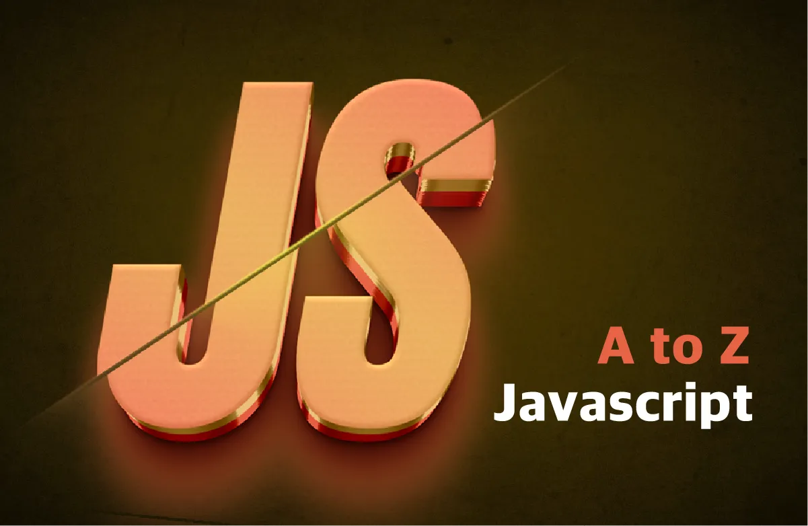

# one_bite_javaScript# 📘 A to Z Javascript

> ⚠️ **본 자료는 [효빈님 강의 - 한 번에 끝내는 자바스크립트] 내용을 포함하고 있습니다.**  
> 강의 교안 및 자료는 **개인 SNS, 블로그에서 사용 가능**합니다. 😊  
> 단, **본 교안의 링크는 공유 불가능**하다는 점 주의해주세요!

---

## 🧐 강의 소개

자바스크립트의 최신 문법을 다루며, 라이브러리 없이  
**순수한 자바스크립트(바닐라 JS)** 만을 사용해

- API 호출
- DOM 조작
- 상태 관리
- 라우팅
- SPA 개발

총 **2개의 프로젝트**를 통해 실습하며 학습하는 강의입니다.

---

## 🙋🏻‍♀️ 이런 분들께 추천해요

### ✅ 기초부터 심화까지 한 번에 학습하고 싶은 분

- 기초 이론부터 프로젝트 개발까지 한 번에 완성
- 프로젝트를 통해 필요한 개념들을 실제로 적용하며 습득 가능

### ✅ 프론트엔드 취업 준비 중인 분

- React.js, Next.js, Vue.js 등 **프레임워크의 근본이 되는 바닐라 자바스크립트**를 자세히 학습

### ✅ 바닐라 자바스크립트에 자신 없는 분

- 이미 프레임워크나 라이브러리를 사용 중이라도, 근본 개념을 탄탄히 익힐 수 있도록 구성됨
- DOM 조작, 상태 관리, 라우팅, SPA의 기초를 직접 구현해보며 학습 가능

---

## 📌 본 강의 출처

> 🧑‍🏫 **강사: 효빈님 (YouTube / 인프런 등)**  
> 본 README는 효빈님의 자바스크립트 강의 내용을 정리한 개인 학습용 자료입니다.
